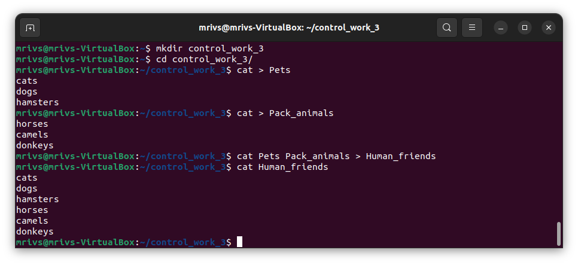
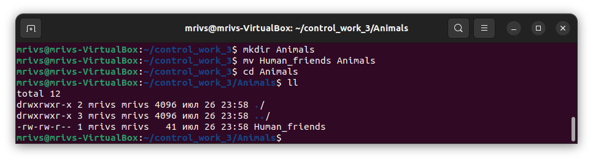

1. Используя команду cat в терминале операционной системы Linux, создать
два файла Домашние животные (заполнив файл собаками, кошками,
хомяками) и Вьючные животными (заполнив файл Лошадьми, верблюдами и
ослы), а затем объединить их. Просмотреть содержимое созданного файла.
Переименовать файл, дав ему новое имя (Друзья человека).

        mkdir control_work_3
        cd control_work_3
        cat > Pets
        cat > Pack_animals
        cat Pets Pack_animals > Human_friends
        cat Human_friends

2. Создать директорию, переместить файл туда.

        mkdir Animals
        mv Human_friends Animals

3. Подключить дополнительный репозиторий MySQL. Установить любой пакет
из этого репозитория.

4. Установить и удалить deb-пакет с помощью dpkg.

5. Выложить историю команд в терминале ubuntu.