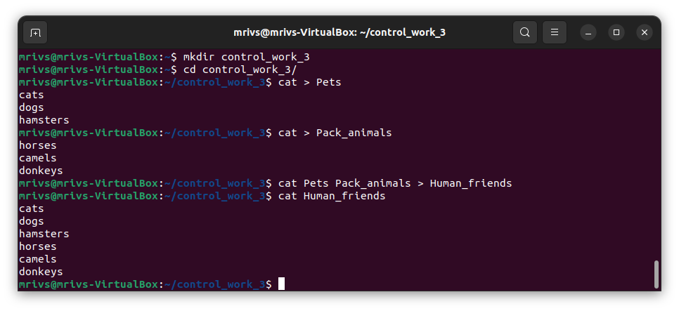
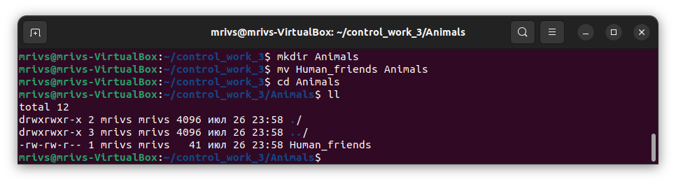
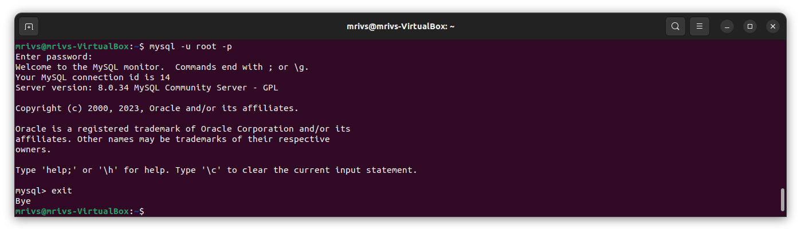
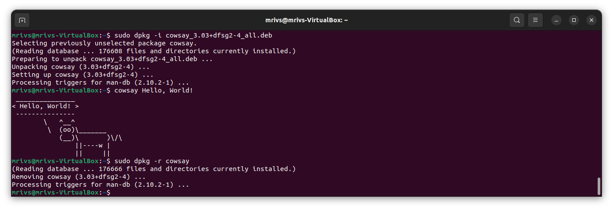
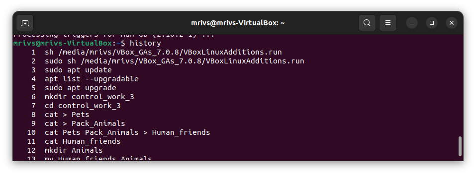

1. Используя команду cat в терминале операционной системы Linux, создать
два файла Домашние животные (заполнив файл собаками, кошками,
хомяками) и Вьючные животными (заполнив файл Лошадьми, верблюдами и
ослы), а затем объединить их. Просмотреть содержимое созданного файла.
Переименовать файл, дав ему новое имя (Друзья человека).

        mkdir control_work_3
        cd control_work_3
        cat > Pets
        cat > Pack_animals
        cat Pets Pack_animals > Human_friends
        cat Human_friends

2. Создать директорию, переместить файл туда.

        mkdir Animals
        mv Human_friends Animals

3. Подключить дополнительный репозиторий MySQL. Установить любой пакет
из этого репозитория.

        wget https://dev.mysql.com/get/mysql-apt-config_0.8.26-1_all.deb
        sudo dpkg -i mysql-apt-config_0.8.26-1_all.deb
        sudo apt update
        sudo apt install mysql-server -y
        mysql -u root -p

4. Установить и удалить deb-пакет с помощью dpkg.

        wget http://archive.ubuntu.com/ubuntu/pool/universe/c/cowsay/cowsay_3.03+dfsg2-4_all.deb
        sudo dpkg -i cowsay_3.03+dfsg2-4_all.deb
        cowsay Hello, World!
        sudo dpkg -r cowsay

5. Выложить историю команд в терминале ubuntu.

        history

